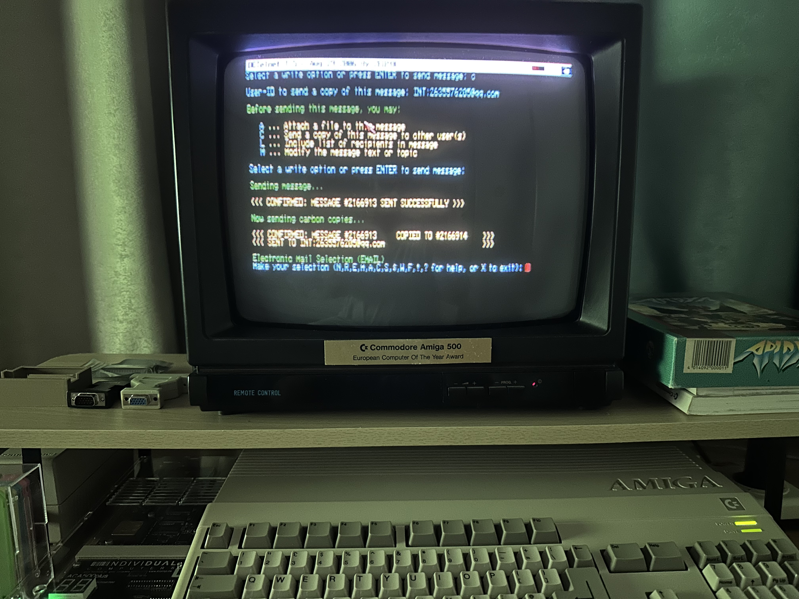

<div align="center">

# Hi, I'm WrankleHia

### You can also call me Aru

<p>
  <a href="./README.md">
    
  </a>
  <a href="./README_EN.md">
    
  </a>
</p>

</div>

## About Me

🎓 I'm currently an undergraduate student in China, studying in a computer-related field.

🇮🇹 Heading to the **University of Trento in 2027 to pursue my Master's degree**.

🎂 **Age:** 20  
🎉 **Birthday:** November 20, 2005<br>
🔢 **Height/Weight:** 184 cm / 79 kg<br>
🌏 **Languages:** Chinese / English / Korean (a little)<br>
🏆 **Achievements:** 3 provincial-level awards and several university-level awards<br>
🗺️ **Countries/Regions Visited:** 🇨🇳🇭🇰🇲🇴🇰🇷🇯🇵🇻🇳🇹🇭🇲🇾🇸🇬

I'm a relatively introverted person, but I can become quite talkative when we share the same interests. :)

I enjoy collecting bank cards, vintage cameras, game consoles, and computers.

My favorite vintage computer is the **Commodore Amiga 500 (1987)**.

<p align="center">
  
</p>

<p align="center">
  <sub>My Amiga 500 browsing a BBS online.</sub>
</p>

> The Amiga 500 platform was home to the early development of several pieces of software and tools that are still familiar to us today, including **Traces** (predecessor to Blender), **FastRay** (predecessor to Cinema 4D), and **Vim**.

I'm also fascinated by early consumer technology and enjoy exploring how older technologies worked, such as dial-up Internet and other technologies from the early days of personal computing and the Internet.

There aren't many public repositories on my GitHub yet, as some of my projects are still under development or haven't been uploaded.

I'll gradually share more of my projects and other interesting things here.

---

<p align="center">
  WrankleHia (Aru)'s Virtual Avatar
</p>

<table align="center">
  <tr>
    <td align="center">
      <b>2D (Completed in 2021)</b>
    </td>
    <td align="center">
      <b>3D (Completed in 2022)</b>
    </td>
  </tr>
  <tr>
    <td align="center">
      
    </td>
    <td align="center">
      
    </td>
  </tr>
</table>

---

## Tech Stack

### Languages

<p>
  
</p>

### Development & Tools

<p>
  
</p>

### Systems & Infrastructure

<p>
  
</p>

---

## 🚀 Interests

```text
💻 Programming & Software Development
🌐 Front-end Development
🖥️ Servers & Networking
🐧 Linux
🎮 Game Development
🎨 3D Graphics
🔧 Hardware & Embedded Systems
```

## 📫 Contact Me

<p>
  <a href="mailto:aru@wranklehia.cn">
    
  </a>
</p>

---

<div align="center">

</div>
